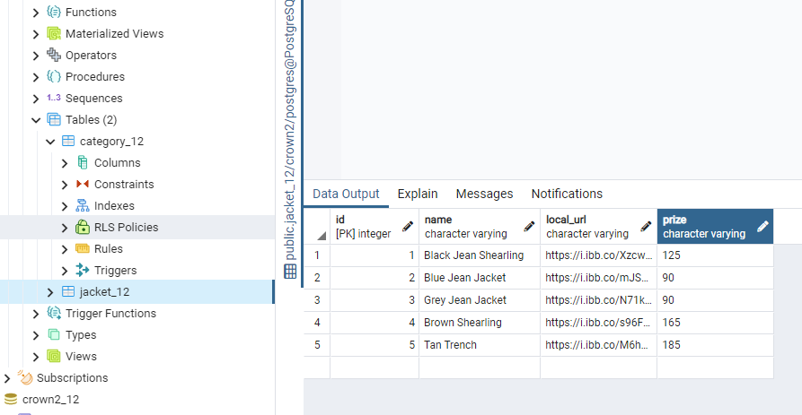
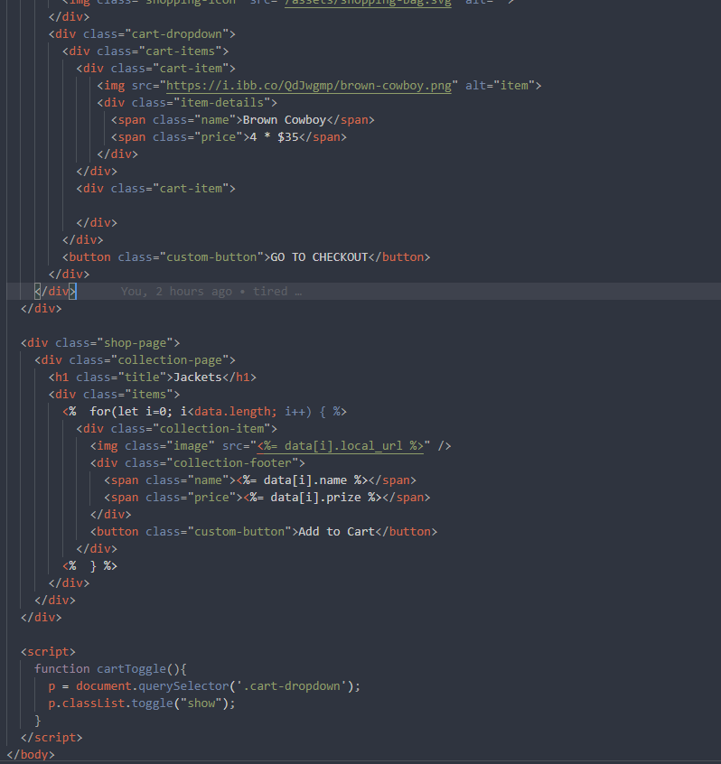
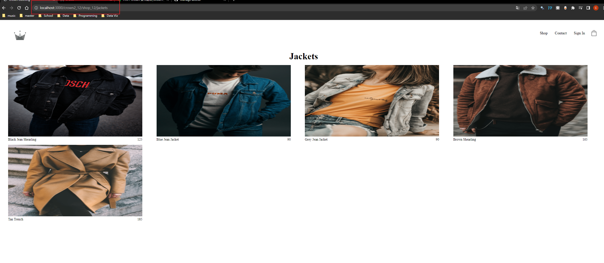

**Setup**
```python
$ npm install express-generator -g 
$ npm install nodemon
```
**Generator app**
```python
$ mkdir (folder name)
$ cd (folder name) 
$ express --view=ejs crown2_12(app name)
$ code crown2_12 (app name)
```
**Install package**
```python
$ npm i
```
**Start app**
```python
npm start
```
**Modify to nodemon**
    1. open package.json
    2. modify
``` js
 "scripts": {
    "start": "node ./bin/www"
  }
> to
 "scripts": {
    "start": "nodemon ./bin/www"
  } 
```
**Modify public**

    1. open folder - public
    2. delete all 
    3. add crown_themes

**Modify views**

    1. add a folder crown2_12
    2. copy index.html to this folder
    3. change the file type by renaming the file to index.ejs

**Create Router** 

    // change the ui
    1. open app.js
    2. then adding
```js
app.use('/', indexRouter);
app.use('/users', usersRouter);
app.use('/crown2_12', crown2_12_Router); // this line
// and 
var indexRouter = require('./routes/index');
var usersRouter = require('./routes/users');

const crown2_12_Router = require('./routes/crown2_12') // this line 

var app = express();
```
    3. then adding file crown2_12.js 
    4. copy the code of file ./index.js
    5. then change the code to
```js
router.get('/', function(req, res, next) {
    res.render('crown2_12/index', { id: '409650412', title: 'crown2' });
  });
```

**Add name and id**

    1. go to the /views/crown2_12/index.ejs
    2. add this
```html
<div class="homepage">
    <div> // this line 
      <h3> <%= title %> <%= id %> </h3> // this line 
    </div> // this line
    <div class="directory-menu">
```
### Heroku

    1. login
    2. create new app > name: crown2-1102db-hw
    3. => Resources page => Add-ons 
    4.type "Herok  Postgres" at the quick add
    5. => Setting => Config Vars => Reveal Config Vars
    6. copy
``` 
postgres://
rsiuqaahnockfn: // user.name
3e81cac92db030ea18463bbd38c5c93c1febb6aa1bcbc519c0f51d304e91b950@ // password
ec2-52-21-136-176.compute-1.amazonaws.com: // hostname
5432/ // port
d30j7qmalh3a9c // maintenance
```
### pgAdmin
| pgAdmin | Heroku |
| -------:| ------:|
|Host name|ec2-52-21-136-176.compute-1.amazonaws.com|
|Port| 5432|
|Maintenance|d30j7qmalh3a9c|
|Password|3e81cac92db030ea18463bbd38c5c93c1febb6aa1bcbc519c0f51d304e91b950|

**Search Server**

**Add Node_Env**

**Connect Heroku to Github**

    1. => Deploy page
    2. search repo
    3. connect repo


    4. enable auto deploy


    5. press deploy at "Manual Deploy"
    // if error then 
```python
$ npm install heroku
```
**Modify script**
    
    1. => package.json
    2. modify this 
```js
"scripts": {
    "start": "nodemon ./bin/www",
    "dev": "nodemon ./bin/www" // add this line
  },
```

    3. then open app on Heroku

[Open app](https://crown2-1102db-hw.herokuapp.com/crown2_12)

**Open pgAdmin**

    1. create table

**Connect with database

    1. => 1102DB_HW/CROWN2_12  => adding folder utilis 
    2. adding datbase.js
    3. install package 
```python
$ npm install pg
```
    4. => utilis/database.js
```js
const { Pool } = require('pg');
const { connectionString } = require('pg/lib/defaults');

const isProduction = process.env.NODE_ENV === 'production';

let pool;

if(isProduction) {
    pool = new Pool (
        {
            connectionString: process.env.DATABASE_URL,
            ssl: { rejectUnauthorized: false }
        }
    )

}else {
    pool = new Pool ({
        user: 'postgres',
        host: 'localhost',
        port: '5432',
        database: 'crown2',
        password: '0000'
    });
}

module.exports = pool;
```
**pgAdmin**

    1. => pgAdmin find "d30j7qmalh3a9c"
    2. Restore crown.tar
**Connect to database**

    1. => Create new folder models
    2. create "Category_12.js
    3. Typing
```js
const db = require('../utilis/database');

const Category_12 = class Category_12 {

        constructor(id, name, size, remote_url, local_url, link_url) {
                this.id = id;
                this.name = name;
                this.remote_url = remote_url;
                this.local_url = local_url;
                this.link_url = link_url;
        }


        static async fetchAll() {
            try {
                let results = await db.query(`SELECT * from category_12`);
                // console.log('results', JSON.stringify(results.rows));
                return results.rows;
            } catch (err) {
                console.log('error', err);
            }
        }
}

//testing 
//const test = async () => {
//    let results = await Category_12.fetchAll();
//    console.log('test result', JSON.stringify(results))
//}
//test();

module.exports = Category_12.js;
```
    4. => /routes/crown2_12.js
    5. modify the code 
```js
var express = require('express');
const Category_12 = require('../models/Category_12'); //this line
var router = express.Router();

/* GET home page. */
router.get('/', async function(req, res, next) {
  try {
    let results = await Category_12.fetchAll(); // this line
    console.log('results', JSON.stringify(results)); // this line
    res.render('crown2_12/index', {  // this line
      data: results, // this line
      id: '409650412', // this line
      title: 'crown2' }); // this line
  }catch(err){ // this line
    console.log('error', err) // this line
  }
    
  });

module.exports = router;

```
**for loop**

    1. => /views/crown2_12/index.ejs
    2. modify menu-items

    
    3. delete all menu item
    4. add this
```js
  <div class="homepage">
    <div>
      <h3> <%= title %> <%= id %> </h3>
    </div>
    <div class="directory-menu">

      
    <%  for(let i=0; i<data.length; i++) { %> // this line
      <div class="<%= data[i].size %> menu-item"> // this line
        " alt=""> // this line
        <a href="<%= data[i].link_url %>" class="content"> // this line
          <h1 class="title"><%= data[i].name %></h1> // this line
          <span class="subtitle">SHOP NOW</span> // this line
        </a> // this line
      </div> // this line
    <%  } %> // this line


    </div>
  </div>
```
**Adding new page jackests**

    1. => pgAdmin
    2. create new table

    
    3. => models
    4. create 'shop_12.js'
    5. copy the code from 'Category_12'
    6. modify the code 
```js
const db = require('../utilis/database');

const shop_12 = class shop_12 { // this line

        constructor(id, name, local_url, prize) { // this line
                this.id = id; // this line
                this.name = name; // this line
                this.local_url = local_url; // this line
                this.prize = prize; // this line
        }


        static async fetchAll() {
            try {
                let results = await db.query(`SELECT * from jacket_12 ORDER BY id`); // this line
                // console.log('results', JSON.stringify(results.rows));
                return results.rows;
            } catch (err) {
                console.log('error', err);
            }
        }
}

// testing 
//const test = async () => {
//    let results = await shop_12.fetchAll(); // this line
//    console.log('test result', JSON.stringify(results))
//}
//test();

module.exports = shop_12;
```
    
    7. => routes
    8. create 'jackets.js'
    9. copy the code from 'crown2_12.js'
    10. modify the code 
```js
var express = require('express');
const shop_12 = require('../models/shop_12'); // this line
var router = express.Router();

/* GET home page. */
router.get('/', async function(req, res, next) {
  try {
    let results = await shop_12.fetchAll(); // this line
    console.log('results', JSON.stringify(results));
    res.render('crown2_12/jackets', { // this line
      data: results});
  }catch(err){
    console.log('error', err)
  }
    
  });

module.exports = router;
```

    11. => app.js
    12. add routes
```js
const crown2_12_Router = require('./routes/crown2_12')
const jackets_Router = require('./routes/jackets') // this line

app.use('/crown2_12', crown2_12_Router);
app.use('/crown2_12/shop_12/jackets', jackets_Router) // this line
```

    13. copy 'jackets.html' to views/crown2_12
    14. modify to 'jackets.ejs'
    15. modify to for loop
```js
<div class="shop-page">
    <div class="collection-page">
      <h1 class="title">Jackets</h1>
      <div class="items">
        <%  for(let i=0; i<data.length; i++) { %>
          <div class="collection-item">
            " />
            <div class="collection-footer">
              <span class="name"><%= data[i].name %></span>
              <span class="price"><%= data[i].prize %></span>
            </div>
            <button class="custom-button">Add to Cart</button>
          </div>
        <%  } %>
      </div>
    </div>  
  </div>
```


